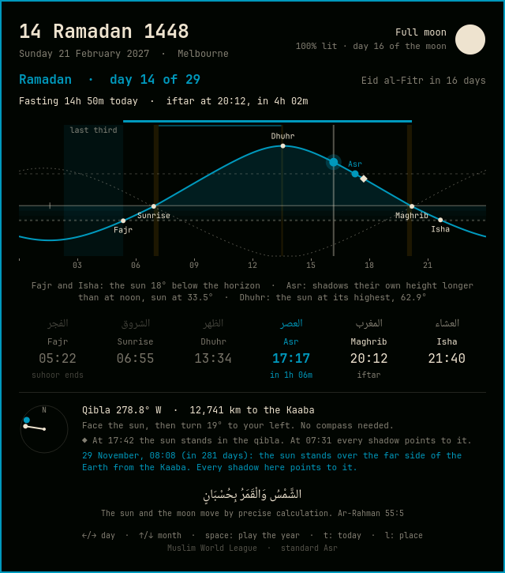

# Falak

Prayer times, the qibla, the moon and the hijri date in the Omarchy bar. Falak works them out on your machine from the positions of the sun and moon. It never touches the network and needs no account.

The pill next to your clock counts down to the next prayer. For the first twenty minutes of a prayer's time it shows that prayer instead, in your theme's accent colour.

Click the pill and you get the sun's altitude across the day, with each prayer marked where the curve crosses its angle. Fajr is the sun 18° below the horizon. Asr comes when shadows reach a set length. Maghrib is sunset. Press space and the whole year plays, so you can watch the times drift with the seasons and see why.

## What it does

- Six times for your place, from 26 calculation methods. Out of the box it picks the method and Asr school that most mosques in your country use; press `m` in the panel to choose another.
- The qibla bearing and distance, plus how far to turn from the sun ("face the sun, then turn 19° to your left"). The chart marks the moment the sun stands in the qibla, and the panel counts down to the next Rasd al-Qibla your sky can see.
- The hijri date, taken from the actual new moon with the Umm al-Qura rule. It rolls over at Maghrib.
- Where the new crescent can be seen (`n`): a world map for the first three evenings after each new moon, shaded by Odeh's criterion (the one the Islamic Crescents' Observation Project uses), and when and where to look from your place.
- Adhan and reminders (`a`), off until you turn them on in the panel. Each prayer can be off, a notification, or a notification with the adhan, and you can add a reminder some minutes before each prayer and a suhoor reminder in Ramadan. You pick the adhan and, separately, the Fajr adhan from the bundled recordings (Makkah, Madinah, Masjid al-Aqsa, Mishary Alafasy, three Fajr adhans that include "as-salatu khayrun min an-nawm", and three freely licensed ones) and set the volume. "Test now" plays one straight away. The adhan stays silent while Do Not Disturb is on or a screen recording is running, and clicking its notification stops it. If you turn on prayer focus, Falak also holds notifications and pauses whatever is playing for 10 to 30 minutes from each prayer's start, then puts both back as they were. To use a recording you prefer, put it in `~/.local/share/falak/adhans/` (ogg, opus, mp3, wav or flac; the panel has a button that opens the folder) and pick it in the panel.
- Eclipses (`e`): the next six, solar and lunar, with what you will see from your place on its clock: when it starts and ends, how much is covered, how long totality lasts, and a reminder that the eclipse prayer is sunnah. Pick one with ↑/↓ and a world map shows where it can be seen, with the path of totality drawn at its real width. With alerts on, a visible eclipse gets a notification when it begins. The moon comes from Meeus's lunar theory and the results are checked against NASA's eclipse tables.
- The sky (`s`): a full-screen dome of the sky over your place, zenith in the middle and the horizon round the edge, with 1,600 stars, the constellations, the planets, the sun, the moon in its phase and the qibla on the horizon. The brightest stars are labelled in English and in Arabic, and many of their English names come from the Arabic (Aldebaran, الدبران). You can step through time with the arrow keys, or press space to watch it turn.
- A hijri month calendar (`c`): the sacred days, the sunnah fasts (the white days, Mondays and Thursdays, Ashura, Arafah, six of Shawwal) and the days not to fast, with each night's moon. Press `i` there to save the coming year's sacred days as a calendar file in Downloads.
- Fridays. Dhuhr is called Jumu'ah wherever it appears, and you can ask for a Surah al-Kahf reminder on Thursday evening or Friday morning.
- Your mosque's timetable. Put the mosque's CSV in `~/.local/share/falak/mosque/` and its iqama times show under each prayer, with a reminder before them if you want one. The panel has a button that opens the folder.
- Adjustments (`o`): your height above sea level, which moves sunrise and Maghrib, a few minutes either way per prayer to match the timetable you follow, and where home is.
- Travel. More than about 80 km from home, a note reminds you that qasr applies and says which schools also allow jam'. It's a reminder, not a ruling.
- A verse each day about the sky, time or prayer, in Arabic with Pickthall's English.
- Why the times move (`w`): a short tour, including a stick whose shadow grows through the afternoon until Asr.
- Tasbih (`d`): 33, 33 and 34 on three rings, for after prayer.
- A prayer journal (`r`), off until you turn it on. It's a private tick list on this machine only, with no streaks or scores.
- Ramadan: iftar and suhoor countdowns (in seconds for the last ten minutes), the fast drawn over the curve, the last ten nights, the iftar dua and Eid.
- The makruh windows, Duha, Islamic midnight and the last third of the night, drawn on the curve.
- The Moonsighting Committee's seasonal Fajr and Isha, for the UK, Canada and the north, alongside the angle-based methods.
- High latitudes. Where the sun never sinks to the Fajr or Isha angle, Falak estimates both (angle-based, one-seventh or middle of the night) and labels them as estimates.
- Offline place search across 34,000 cities, in any script.
- English, Arabic, Urdu, Persian, Turkish, Malay, Indonesian, French and Bengali. Arabic, Urdu and Persian get a right-to-left layout.

## Install

    omarchy plugin add https://github.com/adnanbwp/omarchy-falak --enable

Update with `omarchy plugin update adnanbwp.falak`. To remove it: `omarchy plugin remove adnanbwp.falak`. Adhans you added, your mosque timetable and the journal stay in `~/.local/share/falak/` until you delete that folder.

## Settings

To choose a place, press `p` in the panel or click the place name. Until you do, Falak uses the weather widget's location.

| Setting | Values | Default |
|---|---|---|
| `method` | `auto`, `MWL`, `Karachi`, `ISNA`, `Egypt`, `Makkah`, `Tehran`, `Jafari`, `Gulf`, `Kuwait`, `Qatar`, `Singapore`, `France`, `France18`, `London`, `Moonsighting`, `Turkey`, `DiyanetEU`, `Russia`, `Dubai`, `JAKIM`, `Tunisia`, `Algeria`, `Kemenag`, `Morocco`, `Portugal`, `Jordan` | `auto` |
| `asr` | `auto`, `standard`, `hanafi` | `auto` |
| `highLatitude` | `angle`, `seventh`, `middle`, `none` | `angle` |
| `hijriOffset` | days, to match local moon sighting | `0` |
| `language` | `auto`, `en`, `ar`, `ur`, `fa`, `tr`, `ms`, `id`, `fr`, `bn` | `auto` |
| `numerals` | `auto`, `native`, `western` | `auto` |

    omarchy bar set adnanbwp.falak method Karachi

## Keys in the panel

`←/→` day, `↑/↓` 30 days, `space` play the year, `t` today, and `?` lists the rest: `c` calendar, `n` new crescent, `e` eclipses, `s` the sky, `a` adhan and alerts, `o` adjustments, `w` why the times move, `d` tasbih, `r` journal, `p` place, `m` method and Asr school, `Esc` back. In the calendar the arrows move by day and week, `[` `]` by month, and `Enter` opens the day.

## For scripts

    omarchy-shell adnanbwp.falak next     # {"prayer":"maghrib","label":"Maghrib","time":"19:29","in":"1h 18m","epoch":...}
    omarchy-shell adnanbwp.falak times    # today's six times, the place and the method
    omarchy-shell adnanbwp.falak hijri    # 25 Rabi' al-Thani 1448
    omarchy-shell adnanbwp.falak pill     # what the bar shows

Every alert Falak fires also runs the `falak-prayer` hook with the event key, headline and details, so a script can act on prayer time: `omarchy hook install falak-prayer <script>`.

## Accuracy

The sun and moon come from the Astronomical Almanac's low-precision formulas. The tests compare the methods with api.aladhan.com (within 1.5 minutes, in Melbourne, Makkah, Istanbul and St. John's local time), JAKIM and Diyanet with their own official timetables (within a minute), check the high-latitude rules for Oslo in June, match 17 Umm al-Qura dates picked at month boundaries, and check the Rasd al-Qibla dates.

Start times on screen round up and sunrise rounds down. That way a displayed time is never earlier than the prayer itself, or than the end of the fast. Your mosque's timetable may still differ by a few minutes, and it's the one to follow.

## Notes

Times follow the chosen place's own clock. If you pick Makkah, you get Makkah's day and Makkah's time, with its UTC offset next to the place name. Falak reads the offsets from your system's timezone database with `zdump`. The longer explanatory sentences stay in English whatever the language setting.

City data: GeoNames, CC-BY 4.0. Land mask: Natural Earth, public domain. Lunar theory tables: astronomia (MIT). Stars, names and constellations: d3-celestial (BSD); planets: JPL's approximate elements. Adhan recordings: seven come from another prayer extension and carry no licence; three are from Wikimedia Commons (CC BY-SA 4.0, public domain, CC0). Details are in `assets/NOTICE.md`. Code: MIT.

## Problems and pull requests

If a time looks wrong or something breaks, open an issue with one of the forms. They ask for a city, never your address. Pull requests are welcome; [CONTRIBUTING.md](CONTRIBUTING.md) explains the tests and how to try a change without restarting your bar.
